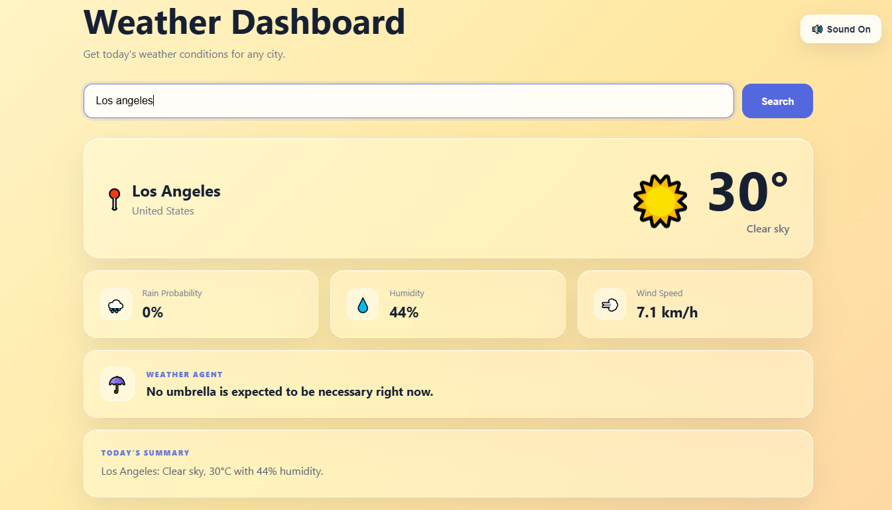
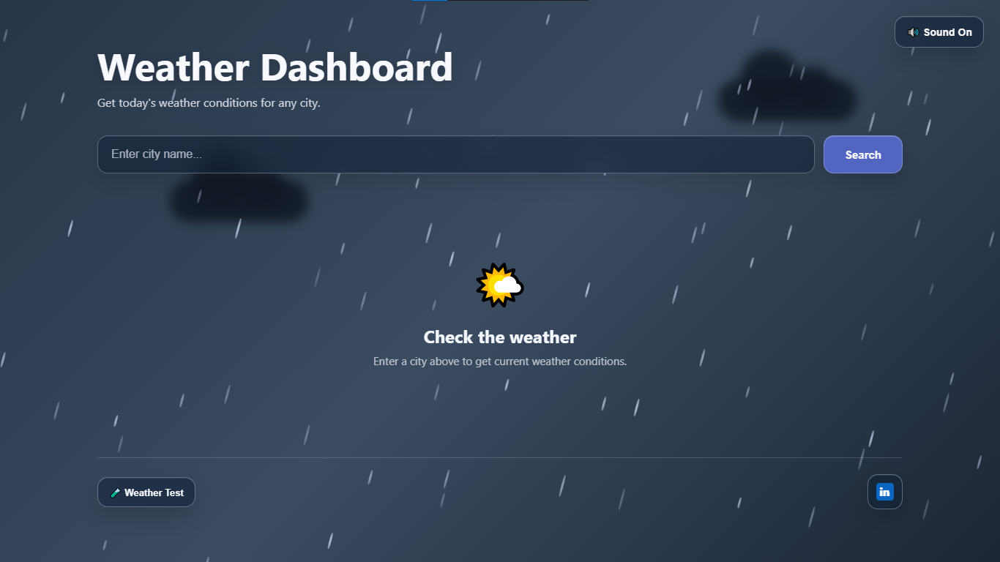
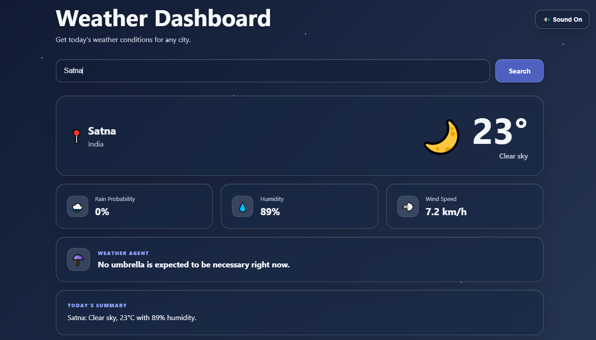

# 🌦️ Weather Dashboard

A responsive, interactive weather web application that brings real-time weather information to life with dynamic backgrounds, weather animations, glassmorphism UI, and atmospheric sound effects.

🔗 **Live Demo:** [Open Weather Dashboard](https://2007faizanali.github.io/weather-dashboard/)  
🌐 **Portfolio:** [Faizan Ali](https://faizan-2107.github.io/Faizan/)

---

## ✨ Features

- 🌍 **City Search** — Search for weather information in different cities.
- 🌤️ **Dynamic Weather Themes** — Backgrounds and visual effects adapt to weather conditions.
- 🪟 **Glassmorphism UI** — Translucent cards, search controls, and interface elements.
- ☀️ **Light Themes** — Bright styling for Sunny and Cloudy weather.
- 🌧️ **Dark Weather Themes** — Atmospheric dark styling for Rain, Heavy Rain, Thunderstorm, and Night.
- 🌦️ **Weather Animations** — Animated visual effects for rain, clouds, and storms.
- 🌙 **Day/Night Detection** — Adapts weather visuals to the searched location's day/night conditions.
- 🔊 **Atmospheric Audio** — Weather-specific sound effects with Sound On/Off controls.
- 🦗 **Night Cricket Ambience** — Separate natural cricket audio for night conditions.
- ⛈️ **Storm Mode** — Special visual styling for stormy weather.
- 🧪 **Weather Test Lab** — Preview different weather themes and visual effects.
- 📊 **Weather Insights** — Displays temperature, rain probability, humidity, wind speed, and a weather summary.
- 📱 **Responsive Design** — Designed for different screen sizes.

---

## 📸 Screenshots

### ☀️ Sunny Theme



### 🌧️ Rain Theme



### 🌙 Night Theme



---

## 🛠️ Tech Stack

- **HTML5** — Application structure
- **CSS3** — Styling, animations, glassmorphism, and responsive layouts
- **JavaScript** — Application logic and interactive features
- **Open-Meteo Weather API** — Weather data and current conditions
- **Open-Meteo Geocoding API** — City and location search
- **GitHub Pages** — Static website hosting

---

## 🌐 APIs

This project uses Open-Meteo to retrieve weather information and location data.

- [Open-Meteo Weather API](https://open-meteo.com/)
- [Open-Meteo Geocoding API](https://open-meteo.com/en/docs/geocoding-api)

---

## 🚀 Run Locally

### 1. Clone the repository

```bash
git clone https://github.com/2007faizanali/weather-dashboard.git
```

### 2. Open the project folder

```bash
cd weather-dashboard
```

### 3. Launch the application

Open `index.html` in your browser, or use a local development server such as **VS Code Live Server**.

No backend server is required for the static version.

---

## 📁 Project Structure

```text
weather-dashboard/
├── index.html
├── README.md
├── screenshots/
│   ├── sunny.png
│   ├── rain.png
│   └── night.png
└── static/
    └── sounds/
        ├── Rain.mp3
        ├── Heavy_rain.mp3
        ├── Soft_wind.mp3
        ├── thunderstorm.mp3
        ├── Sunny.mp3
        └── Night_Crickets.mp3
```

*Note: This structure shows the expected main files. Update the filenames if your actual repository uses different names. The night ambience requires `Night_Crickets.mp3` to be present at the specified path.*

---

## 🎯 Project Goal

The goal of this project is to make weather information more engaging by combining weather API integration with interactive visual effects, dynamic themes, glassmorphism UI, and atmospheric audio.

---

## 👨‍💻 Author

**Faizan Ali**  
AI/ML Engineering Student | Developer

- 🌐 **Portfolio:** [faizan-2107.github.io/Faizan](https://faizan-2107.github.io/Faizan/)
- 💻 **GitHub:** [2007faizanali](https://github.com/2007faizanali)

---

⭐ If you find this project interesting, consider giving the repository a star!